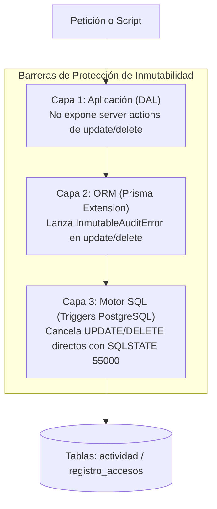
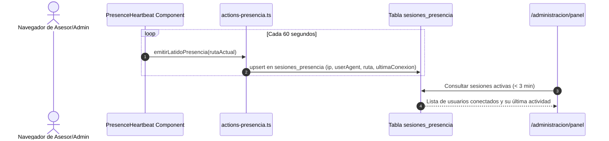

# Arquitectura de Auditoría Inmutable, Presencia en Vivo y Supervisión

Este documento detalla la arquitectura técnica, modelos de datos y mecanismos de seguridad implementados en **Gestión Inmobiliaria Naranjo** para garantizar la trazabilidad forense, el monitoreo operativo y la integridad de la información.

---

## 1. Auditoría Inmutable en Tres Capas

Para cumplir con las normas de seguridad corporativa y los estándares de no repudio, los eventos operacionales y los registros de autenticación son **estrictamente de sólo inserción (*append-only*)**. Se bloquea cualquier posibilidad de modificación o eliminación manual a través de tres barreras de defensa:



### Capa 1: Capa de Aplicación y DAL
- En [`src/lib/dal.ts`](../src/lib/dal.ts) y [`src/lib/audit.ts`](../src/lib/audit.ts), las operaciones de auditoría solo ofrecen métodos de inserción (`logActividad`, `logAcceso`).
- No existe ninguna Server Action ni API pública que reciba identificadores de actividad para editar o remover filas.

### Capa 2: Extensión de Prisma Client ([`src/lib/prisma.ts`](../src/lib/prisma.ts))
El cliente de Prisma se extiende con un interceptor que valida todas las operaciones sobre los modelos protegidos:
- Modelos vigilados: `Actividad` y `RegistroAcceso`.
- Operaciones denegadas: `update`, `updateMany`, `upsert`, `delete`, `deleteMany`.
- Excepción: Si se intenta ejecutar una operación bloqueada fuera del contexto seguro de depuración reglamentaria, se lanza la excepción tipada `InmutableAuditError`.
- Mecanismo de bypass autorizado: Utiliza `AsyncLocalStorage` (`retentionContext`) que solo se activa al invocar `runWithRetentionPurge()`.

### Capa 3: Disparadores en PostgreSQL (Triggers SQL)
Definidos en la migración `20260920000000_audit_inmutability_triggers`:
- `trg_inmutable_actividad` sobre tabla `public.actividad`.
- `trg_inmutable_registro_accesos` sobre tabla `public.registro_accesos`.
- Ambas funciones PL/pgSQL lanzan una excepción de severidad de base de datos:
  ```sql
  RAISE EXCEPTION 'La tabla actividad es estrictamente inmutable (append-only).'
    USING ERRCODE = '55000';
  ```
- Incluso si un atacante o un script administrativo ejecuta `DELETE FROM actividad` directamente por consola SQL o cliente TCP, PostgreSQL aborta la transacción inmediatamente.

---

## 2. Presencia en Tiempo Real y Sesiones Activas

El sistema monitorea la disponibilidad y el módulo de trabajo de los colaboradores para coordinar la asignación de tareas y detectar actividad anómala.

### Flujo de Latidos (Heartbeats)



1. **Emisión periódica**: El componente cliente [`PresenceHeartbeat`](../src/components/presence-heartbeat.tsx) envía un latido asíncrono cada 60 segundos mediante `emitirLatidoPresencia(pathname)`.
2. **Registro de contexto**: En [`src/app/actions-presencia.ts`](../src/app/actions-presencia.ts), se captura la IP remota del colaborador (vía `x-forwarded-for`), el `User-Agent` y la ruta en la que está trabajando.
3. **Criterio de conexión**:
   - **En línea**: Último latido registrado hace menos de 3 minutos.
   - **Desconectado**: Último latido supera los 3 minutos.
4. **Resistencia a fallos**: Si la petición de latido falla temporalmente por pérdida de red, el error se captura silenciosamente en consola y no interrumpe el trabajo del usuario.

---

## 3. Política de Retención y Tarea Programada (Cron)

Para evitar el crecimiento indefinido de las tablas de auditoría y cumplir con el principio de limitación de plazo de conservación de la Ley 1581 (Habeas Data):

- **Periodo de retención de auditoría**: 12 meses (configurable mediante `AUDIT_RETENTION_DAYS`).
- **Periodo de retención de sesiones de presencia**: 24 horas.
- **Endpoint**: [`/api/cron/retencion`](../src/app/api/cron/retencion/route.ts).
- **Autenticación**: Encabezado `Authorization: Bearer <CRON_SECRET>`.

### Algoritmo de Purga:
```typescript
await runWithRetentionPurge(async () => {
  // 1. Elimina actividades que exceden 12 meses
  await prisma.actividad.deleteMany({
    where: { createdAt: { lt: fechaLimiteAuditoria } },
  });

  // 2. Elimina registros de accesos antiguos
  await prisma.registroAcceso.deleteMany({
    where: { fecha: { lt: fechaLimiteAuditoria } },
  });

  // 3. Elimina sesiones inactivas mayores a 24 horas
  await prisma.sesionPresencia.deleteMany({
    where: { ultimaConexion: { lt: fechaLimiteSesiones } },
  });
});
```

---

## 4. Métricas y Supervisión Administrativa (`/administracion/panel`)

El panel de métricas consolidado en [`src/app/administracion/panel/page.tsx`](../src/app/administracion/panel/page.tsx) es accesible exclusivamente para usuarios con rol `ADMIN`.

### Capa de Acceso a Datos ([`src/lib/dal-admin-panel.ts`](../src/lib/dal-admin-panel.ts)):
Agrupa las métricas en 5 dominios:
1. **Cartera e Inmuebles**: Conteo de inmuebles activos, viviendas vs. comercios, porcentaje de ocupación con arrendatario asignado y tasa de archivo.
2. **Tareas y Mantenimiento**: Tareas pendientes, vencidas, completadas en el periodo y órdenes de mantenimiento abiertas.
3. **Tickets de Soporte**: Tickets abiertos, en progreso, resueltos y tiempo promedio de respuesta.
4. **Seguridad y Accesos**: Intentos de inicio de sesión exitosos vs. fallidos, desglose por IP y alertas de anomalías.
5. **Equipo y Productividad**: Ranking de actividad por colaborador y distribución volumétrica por módulo.
